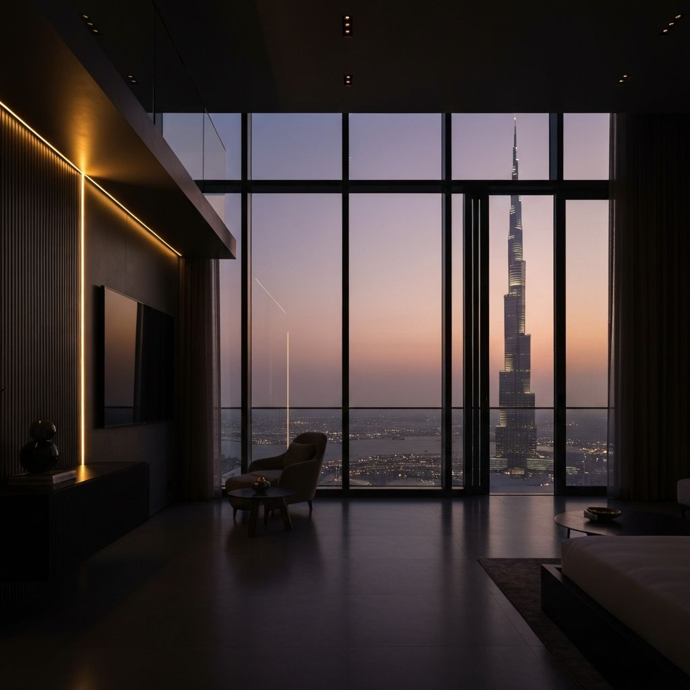

# Vertex Dubai | Boutique Real Estate

A high-performance, cinematic landing page for **Vertex Dubai**, a boutique real estate agency specializing in discreet, off-market luxury residences.



## 🏛️ Project Overview

Vertex Dubai is designed with a "Quiet Luxury" aesthetic, focusing on restraint, elegance, and premium user experience. The site serves as a digital storefront for high-net-worth individuals seeking exclusive access to Dubai's most prestigious properties.

### Key Features

- **Cinematic Entrance**: Smooth staggered animations using Framer Motion to introduce the brand.
- **Curated Inventory**: Dedicated sections for premium listings and off-market opportunities.
- **Discreet Endorsements**: A refined testimonials section featuring voices of distinction from private investors and family offices.
- **Luxury Aesthetic**: A curated color palette (Gold, Obsidian, and Bone) paired with sophisticated typography (*Cormorant Garamond* & *Inter*).
- **Responsive Design**: Fluid layouts optimized for all device sizes, from mobile to ultra-wide displays.
- **Interactive Elements**: Custom cursor and subtle scroll-reveal effects to enhance immersion.

## 🛠️ Tech Stack

- **Framework**: [Next.js 15+](https://nextjs.org/) (App Router)
- **Styling**: [Tailwind CSS v4](https://tailwindcss.com/)
- **Animations**: [Framer Motion](https://www.framer.com/motion/)
- **Icons**: [Lucide React](https://lucide.dev/)
- **Deployment**: [Vercel](https://vercel.com/)

## 🚀 Getting Started

### Prerequisites

- Node.js 18.17 or later
- npm / pnpm / yarn

### Installation

1. Clone the repository:
   ```bash
   git clone https://github.com/Rudra-Nayak/Vertex__Dubai_landing-_page.git
   ```

2. Install dependencies:
   ```bash
   npm install
   ```

3. Run the development server:
   ```bash
   npm run dev
   ```

4. Open [http://localhost:3000](http://localhost:3000) in your browser.

## 📁 Directory Structure

```
├── app/              # Next.js App Router (Layouts, Pages, Styles)
├── components/       # Reusable UI components
│   ├── vertex/       # Core domain components (Hero, Navbar, etc.)
│   └── ui/           # Shared base components
├── public/           # Static assets (Images, Fonts)
└── lib/              # Utility functions and configurations
```

## 📜 License

This project is private and intended for demonstration purposes. All rights reserved by Vertex Dubai.

---

*Crafted with precision for the Dubai real estate market.*
